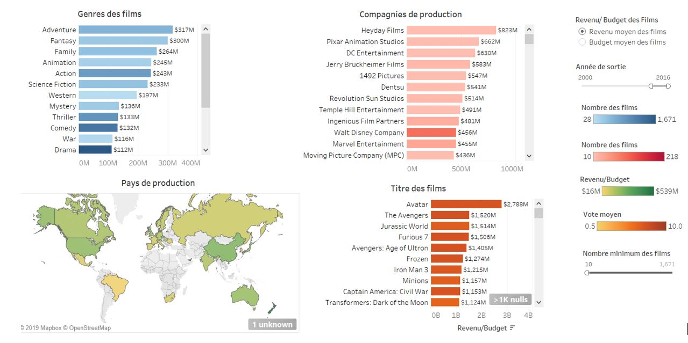
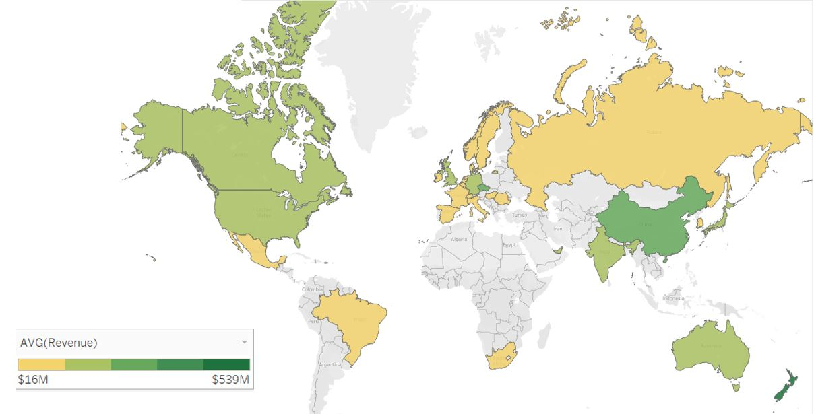
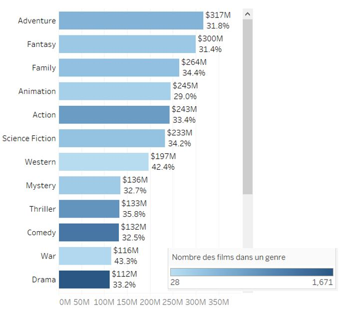
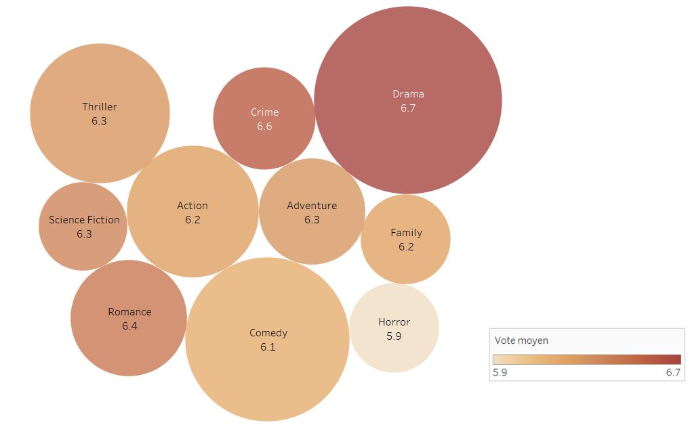
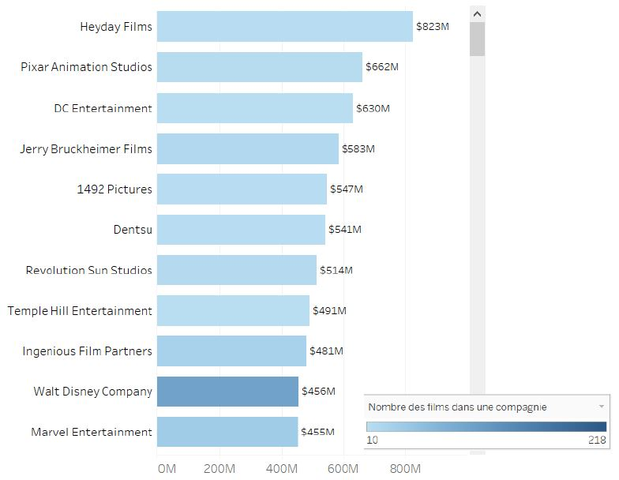
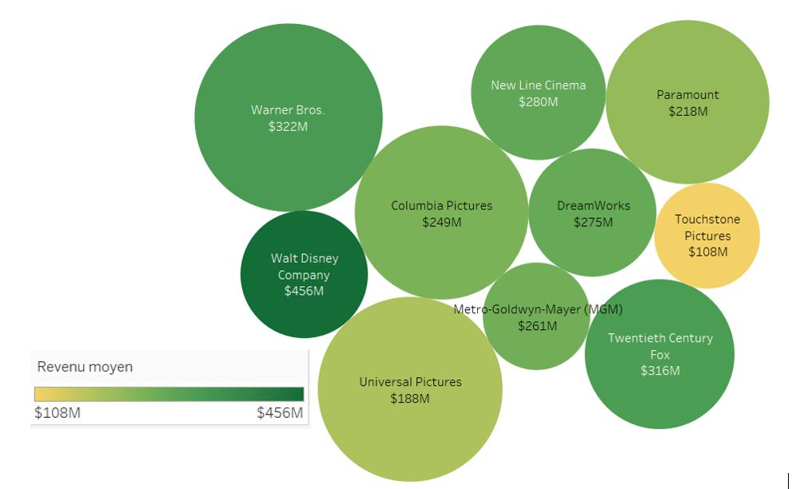
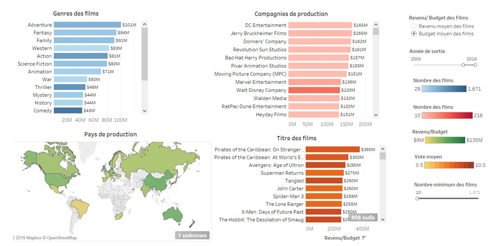
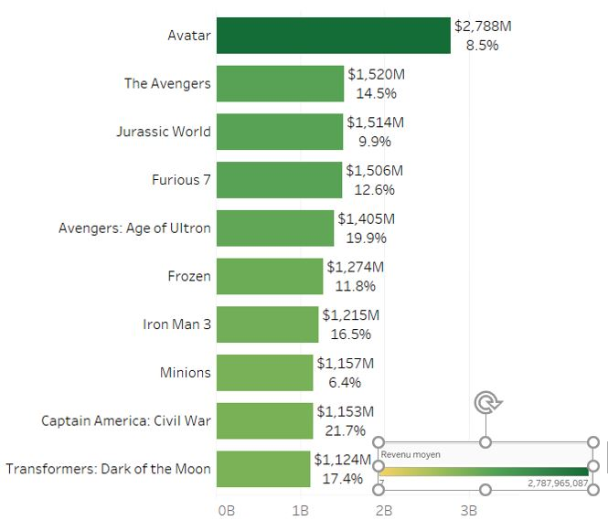
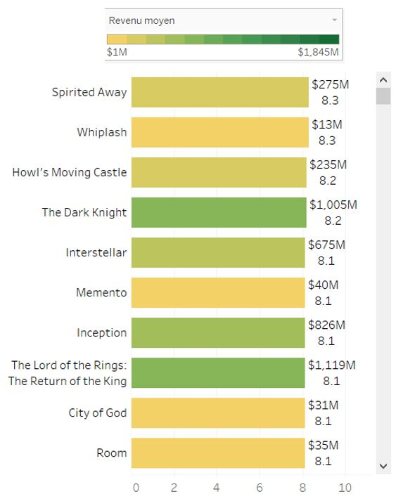

# movie_database

# Tableau analysis of the revenue and budget for movies launched after 2000

## Dashboard of average movie revenues

## Average revenue of movies by production country

## Average revenue and %budget by movie genre

## Movie ratings for the first 10 genres

## Average revenue of movies by production company

## Average revenue of movies by the main 10 production companies

## Dashboard of average movie production budget

## Average revenue of movies and %budget 

## Average revenue of top rated movies

